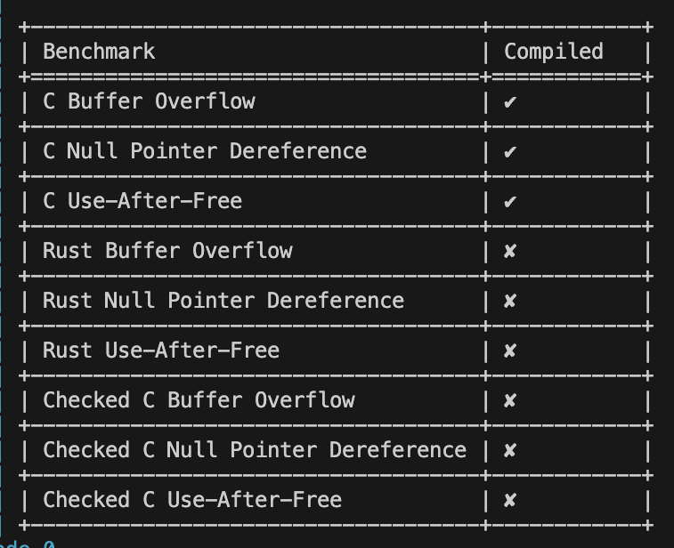

# C Dialect Benchmarks

An analysis of how C and Checked C compare to Rust in terms of memory safety.

## Getting Started

1. **Install the Checked C toolchain**:
   Download the Checked C toolchain tarball from [Checked C Clang Releases](https://github.com/checkedc/checkedc-clang/releases/tag/CheckedC-Clang-12.0.2) and place it in the `checked-c` directory.

2. **Build and run the Docker containers**:
   ```sh
   docker-compose up --build
   ```

## Experimental Methods

To evaluate memory safety across C, Checked C, and Rust, I implemented benchmarks targeting three common vulnerabilities: buffer overflows, use-after-free errors, and null pointer dereferences. Each benchmark was written in all three languages to compare their handling of these issues. I set up a controlled testing environment using Docker containers and Docker Compose, ensuring consistency across all executions.  In the end, I decided to evaluate the memory safety of each by determining if they would allow the memory vulnerabilities to compile or not. I processed all of the results using a Python script and outputted them to show the benchmarks.

## Experimental Results



In my experiment, I tested how different programming languages attempt to compile programs with memory safety vulnerabilities. I found that standard C allowed all programs to compile, and that both Rust and Checked C prevented compilation when unsafe memory operations were detected.

These results suggest that C lacks the memory safety mechanisms to prevent memory-related errors. On the contrary, Rust enforces stricter safety rules and prevents unsafe code from compiling. Checked C was able to detect the buffer overflow, null pointer deference, and use after free errors. While these results may seem promising for Checked C, more thorough testing would need to be completed across more vulnerabilities. Checked C also requires developers to understand how to use its features correctly, as it is an extension to C, but Checked C uses a completely different compiler than normal C.

## Further Research

After completing my experiment, Here are some future areas to explore that I have not had the time to complete:

- **Expand Memory Safety Benchmarks**: Add tests for stack overflows, integer overflows, and dangling pointers; evaluate performance impacts of memory safety mechanisms.
- **Automate Checked C Compiler Installation**: Develop a script to download, extract, and configure the Checked C toolchain; integrate it into the Docker setup for seamless environment provisioning.
- **Automate Benchmark Porting**: Create a tool or script to translate C benchmarks into Checked C and Rust; use static analysis to detect required changes and suggest Checked C annotations.
- **Compare Unsafe Rust vs Safe Rust**: Implement benchmarks using Rust’s unsafe keyword to simulate C-like behavior; compare Safe Rust’s protections against potential pitfalls in Unsafe Rust; analyze how Rust’s borrow checker and ownership model mitigate memory vulnerabilities.
